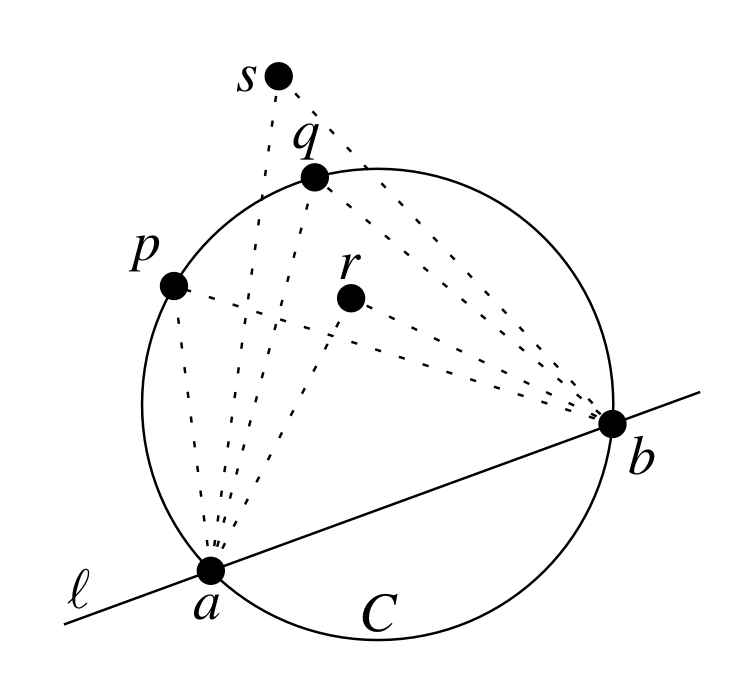
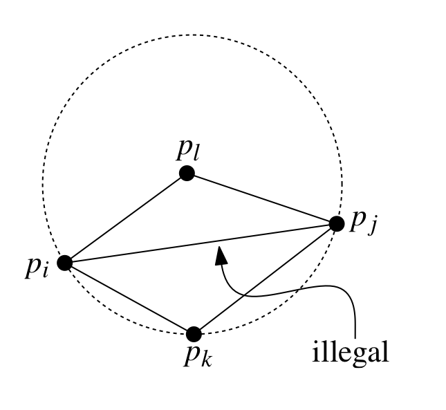
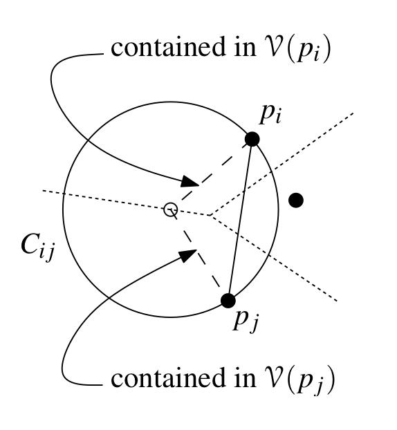

% Computational Geometry

# Triangulation

A Triangulation of the sets of points $P:= {p_1, p_2 , \dots, p_n }$ in the plain is the maximal planar subdivision whose vertex set is $P$. 

A **maximal planar subdivision** is a subdivision $S$ such that no edge between two vertices can be added to $S$ without destroying the planarity (*a graph where no edges cross each other*). This means that any edge that is not in $S$ crosses one of the other edges.

**Theorem 9.1**
$P$ is the set of $n$ points in the plane. $k$ denotes the number of points in $P$ that lie on the boundary of the convex hull of $P$. Then any **triangulation** of $P$ has:

$$ \text{Triangles: } 2n - 2 - k $$
$$ \text{Edges: } 3n - 3 - k $$

**Proof**

We denote some triangulation of $P$ as $T$. Let $m$ be the number of triangles of $T$. The number of faces of $T$ is $n_f = m + 1$ since each triangle represents a bounded face and then we have the unbounded face, hence $m + 1$. The number of edges is therefore: each triangle has 3 edges ($3m$) and the unbounded face has $k$ edges. Since we have counted each edge twice (each edge is shared between two faces) we divide by 2 and get the number of edges $n_e$:

$$ n_e = (3m + k) / 2 $$

Given Euler's formula:

$$ n - n_e + n_f = 2 $$

we plug the values of $n_e$ and $n_f$ and get:

\begin{align*} 
    n - \frac{3m + k}{2} + (m+1) &= 2 \\
    2n - (3m + k) + 2(m+1)       &= 4 \\
    2n - 3m - k + 2m + 2         &= 4 \\
    2n - m - k + 2               &= 4 \\
    -m                           &= 4 - 2n + k - 2 \\
    m                            &= 2n - 2 - k
\end{align*}

and we have our number of triangles, $m$. Plug in the value of $m$ to $n_e$ and we get:

\begin{align*}
    n_e &= \frac{3m + k}{2} \\
        &= \frac{3(2n - 2 -k) + k}{2} \\
        &= \frac{6n - 6 - 3k + k}{2} \\
        &= \frac{6n - 6 - 2k}{2} \\
        &= 3n - 3 - k
\end{align*}

and we have our number of edges.

**Illegal edge**

An edge is illegal if we can increase the smallest angle by flipping that edge.

$$ \text{min } \alpha_i < \text{min } \alpha_i' $$

This means that if we have a triangulation $T$ including in illegal edge $e$, we can obtain another triangulation $T'$ by flipping $e$ and $A(T') > A(T)$ where $A(T)$ is the angle vector for $T$. **Angle optimization** means that the size of an angle vector for some triangulation $T$ of $P$ is larger than any other triangulation of $P$. 

**Thales's Theorem**

Let $C$ be a circle with line $l$ intersecting it in $a$ and $b$. Let $p$, $q$, $r$ and $s$ all lie on the same side of $l$ where $p$ and $q$ lie exactly on $C$, $r$ is contained within $C$ and $s$ lies outside of $C$. Then:

$$\measuredangle arb > \measuredangle abp = \measuredangle aqb > \measuredangle asb$$

**Lemma 9.4**

We have edge $\overline{p_ip_j}$ which is incedent to triangles $p_ip_jp_k$ and $p_ip_jp_l$. $C$ is a circle through $p_i$, $p_j$ and $p_k$. The edge $\overline{p_ip_j}$ is illegal if and only if $p_l$ lies on the interior of $C$. It's also illegal for the reason that we can find an angle in the two incident triangles which is lower than any after we do the flip.

---

# The Delaunay Triangulation

**Theorem 9.5**

The Delaunay graph of $P$ is a plane graph (*no two edges in the embedding cross*).

**Proof (by contradiction)**

We consider an edge $\overline{p_ip_j}$ that is in the Delaunay graph if and only if there exists a closed disc $C_{ij}$ with $p_i$ and $p_j$ on its boundary and no other point(*site*) contained in it. Note that the center of this disc lies on the common edge of $V(p_i)$ and $V(p_j)$ ($V(p)$ being the Voronoi cell of $p$) We then define $t_{ij}$ to be the triangle with $p_i$, $p_j$ and the center of $C_{ij}$ as vertices. As the figure below shows, the edge from the center of the closed disc to $p_i$ (this is one of the edge of $t_{ij}$) is contained in the $V(p_i)$. The same goes for $p_j$. 

Now we look at another edge in the Delaunay graph: $\overline{p_kp_l}$, having the circle $C_{kl}$, triangle $t_{kl}$. For the sake of contradiction, we say that the two edges, $\overline{p_ip_j}$ and $\overline{p_kp_l}$ intersect. Since both $p_k$ and $p_l$ must lay outside $C_ij$ (by definition), it implies that the edge $\overline{p_kp_l}$ must therefore intersect one of the edges of $t_{ij}$ incident to the center of $C_{ij}$ (this is because since we said originally that the two edges intersect, then it also intersects one of the edges in the triangle, it cuts the circle in that manner). And by the same argument, $\overline{p_ip_j}$ must therefore intersect one of the edges of $t_{kl}$ incident to the center of $C_{kl}$. Furthermore, one of the edges of $t_{ij}$ incident to the center must intersect with one of the edges of $t_{kl}$ incident to the center. This would mean that the edges that are incident to the center points are contained in multiple cells, which is a contradiction.

