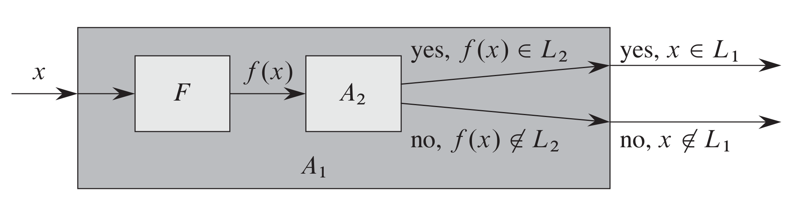

% NP-Completeness

NP-complete problems are problems whose status is unkown, meaning there is no polynomial-time algorithm that has been discovered nor has anyone yet been able to prove that no polynomial-time algorithm can exist for any of those problems.

## P
Consists of classes of problems that are *solvable* in polynomial time, $O(n^k)$ where $n$ is the size of the input.

## NP
Consists of classes of problems that are *verifiable* in polynomial time using a certificate of a solution.

Problems in P are also in NP, since it can be solved in polynomial time and verified wihtout any certificate. We belive $P \subseteq NP$ but an open question remains if $P = NP$.

## NPC

A problem is NP-complete if it is in NP and it is as hard as any problem in NP.

---

## Reduction

$A$ is a decision problem we want to solve in polynomial time. We know how to solve a different decision problem $B$ in polynomial time and we have a procedure that transforms the instance $\alpha$ (inputs) af A into some instance $\beta$ of B such that

  * the reduction takes polynomial time
  * the answers to the decisions are the same.

The reduction algorithm provides a way to solve $A$ in polynomial time:

  1. Use polynomial-time reduction algorithm to transform $\alpha$ of A to $\beta$ of B
  2. Run polynomial-time decision algorithm on $\beta$
  3. Use answer for $\beta$ as answer for $\alpha$

Using polynomial-time reductions, we can show that a problem is NP-Complete and that no polynomial-time algorithm exists for problem $B$. We have:

  $$ A \notin P \land T_{p}(A, B)$$

---

# Polynomial time

## Formal-Language framework

A language $L$ is any set of strings made up of symbols from $\Sigma$. 

**Accepting**

Algorithm $A$ accepts an input string $x \in \{0,1\}^{\star}$ if the output of $A(x) = 1$. The language $L$ accepted by $A$ is the set of strings $L = \{x \in \{0,1\}^{\star} : A(x) = 1\}$

$L$ is accepted in *polynomial time* by $A$ if it is accepted by $A$ and if there exist an constant $k$ such that any string $x \in L$ of length $n$, $A$ accepts $x$ in time $O(n^k)$. 

**Deciding**

A language $L$ is *decided* by algorithm $A$ if every string in $L$ is *accepted* by $A$ and every string *not* in $L$ is rejected by $A$. 

$L$ is decided in *polynomial-time* by $A$ such that there exists a constant $k$ such that for any string $x \in \{0, 1\}^{\star}$ of length $n$ , $A$ correctly decides whether $x \in L$ in time $O(n^k)$. 

---

# NP-completeness and reducibility

## Reducibility

$L_1$ is polynomial-time reducible to $L_2$, written : $L_1 \leq_P L_2$ if there is a function $f: \{0,1\}^{\star} \Rightarrow \{0,1\}^{\star}$ so that for all $x \in \{0,1\}^{\star}$:

$$x \in L_1 \text{ if and only if } f(x) \in L_2$$

We call $f$ the *reduction function* and $F$ the *reduction algorithm* that computes $f$. Both run in polynomial-time.

The following must hold:

If $x \in L_1$, then $f(x) \in F_2$. If $x \notin L_1$, then $f(x) \notin L_2$. This also means that providing answer whether $f(x) \in L_2$ directly provides answer to whether $x \in L_1$. 

**Lemma 34.3**

If $L_1,L_2 \subseteq \{0,1\}^{\star}$ are languages such that $L_1 \leq_P L_2$, then $L_2 \in P$ implies that $L_1 \in P$. 

**Proof**

$A_2$ is a polynomial-time algorithm that decides $L_2$. $F$ is the polynomial-time reduction algorithm that computes the reduction function $f$. $A_1$ is constructed as shown in the image below to decide $L_1$. We have input $x \in \{0,1\}^\star$ and we let $A_1$ use $F$ to transform $x$ into $f(x)$. That will then use $A_2$ to test whether $f(x) \in L_2$. We let $A_1$ use the output of the decision of $A_2$. 

## NP-completeness

Showing that if $L_1 \leq_P L_2$ then $L_1$ is not more than a polynomal factor harder than $L_2$. 

We can now define NP-complete languages formaly as:

A language $L \subseteq \{0,1\}^{\star}$ is **NP-complete** if

1. $L \in NP$ and,
2. $L' \leq_P L$ for every $L' \in NP$. 

A language is **NP-hard** if it satisfies property 2 but not necessarily property 1. 

---

# NP-completeness proofs

Instead of reducing every language $L \in NP$ to a given language to prove it's NP-complete, we can use the following lemma:

**Lemma 34.8**

If $L$ is a language such that $L' \leq_P L$ for some $L' \in NPC$, then $L$ is **NP-hard**. If we know that $L \in NP$, then $L$ is NP-complete. 

**Proof**

We know that $L'$ is NP-complete. For all $L'' \in NP$ we have $L'' \leq_P L'$ (by definition of NP-complete problems here above). We also have that $L' \leq_P L$, so by transitivity we have that $L'' \leq_P L$, showing that $L is NP-hard$. If we know that $L \in NP$, then $L$ is also $L \in NPC$.

We can take the following steps to prove that $L$ is NP-complete:

1. Prove that $L \in NP$.
2. Find a known $L' \in NPC$
3. Describe an reduction algorithm $F$ that computes the reduction function $f$ which maps every instance $x \in \{0,1\}^{\star}$ of $L'$ to an instance $f(x) of $L$.
4. Prove that the reduction function $f$ satiesfies that $x \in L'$ if and only if $f(x) \in L$ for all $x \in \{0,1\}^{\star}$.
5. Prove that $f$ runs in polynomial-time.

## SAT - Formula satisfiability  (first problem shown to be NP-complete)

**Theorem 34.9**

Satisfiability of boolean formulas is NP-complete. 

**Proof**

We take the steps listed here above:

1. Proof that $SAT \in NP$. This is easy because we can easily verify a solution in polynomial time. The certificate consist of assignment of boolean values to the variables and then we evaluate the expression. 
2. We use `CIRCUIT-SAT` and try to reduce it to `SAT`. In other words, we will reduce any instance of the circuit satisfiability to an instance of formula satisfiability in polynomial time.
3. For each wire $x_i$ in the circuit $C$, the formula $\phi$ has a variable $x_i$. Therefor, the following circuit has the following formula: 
    
    
4. The circuit $C$ is satisfiable when and only when the formula $\phi$ is satisfied because when the circuit has satisfying assignment, each wire of the circuit is well defined. The output of the circuit is 1. Since we assigned the wire values to our variables in $\phi$, each clause will evaluate to 1 and the conjunction of them will also evaluate to 1. The same can be said if we go from the formula to the circuit, when we have a satisfying formula, we can assign each variable to the wire values and the circuit will be satisfied.
5. It is straightforward to construct the formula in polynomial time. 

## 3-CNF-SAT

Stands for 3-conjunctive normal form because each clause has 3 distinct literals (variable or its negation), each one with an OR clause between them. The clauses all have an AND between them. 

**Theorem 34.10**

Satisfiability of 3-conjunctive normal form is NP-complete.

**Proof**

We take the same steps:

1. We can easily verify the satisfiability of 3-CNF by replacing the variables with a boolean value, just like we did for `SAT`. Therefore, $\text{3-CNF-SAT} \in NP$. 
2. We will use `SAT` to show that `3-CNF-SAT` is NP complete by $SAT \leq_P 3-CNF-SAT$.
3. To reduce `SAT` to `3-CNF-SAT`, we take three steps. First, we construct a binary parse tree for formula $\phi$ where the literals are leaves and connectives (operators) are the nodes. We have the formula 
    
    $$\phi = ((x_1 \rightarrow x_2) \lor \neg ((\neg x_1 \leftrightarrow x_3) \lor x_4)) \land \neg x_2$$

which has the corresponding binary prase tree:

We can then rewrite $\phi$ as the AND of the root variable and a conjunction of the clauses that describe the operation at each node. This becomes:

Each clause in $\phi '$ has at most 3 literals, but we might be able to have fewer. We will therefore take the second step which converts each clause of $\phi '$ into a conjuctive normal form. 
THIS IS ALL BASIC SO JUST READ AGAIN IF IN DOUBT
4. Each step of the reduction maintained the satisfiability.
5. Basic.

# NP-complete problems

## CLIQUE

**Theorem 34.11**

The clique problem is NP-complete.

**Proof**

As always, the first step is to show that $\text{CLIQUE } \in NP$. We'll use the set $V' \subseteq V$ as the certificate and check for each pair, $u, v \in V'$ if the edge $(u,v)$ belongs to E. This can easily be done in polynomial time.

Next step is the reduction: $\text{3-CNF-SAT } \leq_P \text{ CLIQUE}$. We start with the 3-conjunction normal form formula $\phi = C_1 \land C_2 \land \dots C_k$ where each clause $C_r$, $r = 1, 2, \dots , k$ has distinct literals $l_1^r, l_2^r$ and $l_3^r$. We construct a graph $G$ such that $\phi$ is satisfiable if and only if $G$ has a clique of size $k$. 

The construction of $G = (V,E)$ is as follows: For each clause $C_r = (l_1^r, l_2^r, l_3^r)$ in $\phi$, we place a triple of vertices $v_1^r, v_2^r, v_3^r$ into $V$ and we put an edge between two vertices $v_i^r$ and $v_j^s$ such that both of the following hold:

- $v_i^r$ and $v_j^s$ are in different triples ($r \neq s$)
- their corrisponding literals are not negation of one another, $l_i^r$ is not the negation of $l_j^s$.

We can show that this transformation of $\phi$ is a reduction into $G$. 

First, suppose that $\phi$ has a satisfying assignment. That means that each clause $C_r$ contains at least one literal assigned to 1 and each such literal corresponds to a vertex in $G$. We claim that if we pick one such true literal from each clause yields a set $V'$ which is a clique in $G$. We can take any two vertices $v_i^r$ and $v_j^s$ where $r \neq s$, their corresponding literals $l_i^r$ and $l_j^s$ both map to 1 given the satisfying assignment (the vertices are picked from literals with 1). The literals can't be compliment of one another (since that's how we constructed the graph) so the edge $(v_i^r$ and $v_j^s)$ belongs to $E$. 

Second, we can show the other way around. Suppose that $G$ has a clique $V'$ of size $k$. We have no edges within a triple, so $V'$ consists of only one vertex from each triple. Therefore, we can assign 1 to each literal without fear of assigning 1 to both a literal and its complement, since $G$ contains no edges between inconsistent literals. This will satisfy each clause and by the conjunction, $\phi$ will therefore be satisfied. 

## VERTEX-COVER

Is the problem of finding a minimum vertex cover in $G = (V,E), that is, a set $V' \subseteq V$ such that this set covers all the edges in in $E$. 

**Theorem 34.12**

The vertex cover problem is NP-complete

**Proof**

First, we show that $\text{VERTEX-COVER } \in NP$. This can be done easily if we're given a graph $G = (V,E)$ and an integer $k$. We choose the certificate to be the vertex cover $V' \subseteq V$ and we can verify that the length of the cover is $k$ and if each edge $(u,v) \in E$ such that either $u \in V'$ or $v \in V'$ in polynomial time. 

We proof that `VERTEX-CONVER` is NP-hard by $\text{CLIQUE } \leq_P \text{ VERTEX-COVER}$. The reduction relies on complimenting the graph $G = (V,E)$ which is the graph $\overline{G} = (V, \overline{E})$ such that $\overline{E} = \{(u,v): u,v \in V, u \neq v \text{ and } (u,v) \notin {E}\}$.

The reduction takes the instance $\langle G, k\rangle$ as input of the clique problem, computes the complement $\overline{G}$ in polynomial-time and the output is $\langle \overline{G}, |V| - k \rangle$ which is an instance of the vertex-cover problem. This mean that graph $G$ has clique of size $k$ if and only if graph $\overline{G}$ has vertex cover of size $|V| - k$. 

Proof that this is a legit reduction: We suppose that $G$ has clique $V' \subseteq V$ so we claim that $V - V'$ is a vertex cover in $\overline{G}$. Take a look at some edge in $\overline{E}$, for example $(z,y)$. We have certainly have that $(z,y) \notin E$ since otherwise there wouldn't exist an exist between them in $\overline{G}$. This implies that at least one of $z$ or $y$ does *not* belong in the clique ($V'$) since the edges between members in the clique are from $E$. For the same reason, at least one of $z$ or $y$ is in $V - V'$ (the actual vertex cover), which means that the edge $z, y$ is covered by a vertex in $V - V'$. Therefore, the set $V - V'$ forms the vertex cover for $\overline{G}$ of size $|V| - k$. 

Conversely, suppose that $\overline{G}$ has vertex cover $V' \subseteq V$. For all $u,v \in V$, if $(u,v) \in \overline{E}$, that means that either $u \in V'$, $v \in V'$ or both since it doesn't matter which edge we pick, one of the incident vertices are part of the vertex cover. If we pick vertices that have no edge between them and are not part of the vertex cover, we are picking an edge in $E$ and these vertices are part of the clique. Hence, $V-V'$ is a clique and the size is $|V| - |V'| = k$. 

